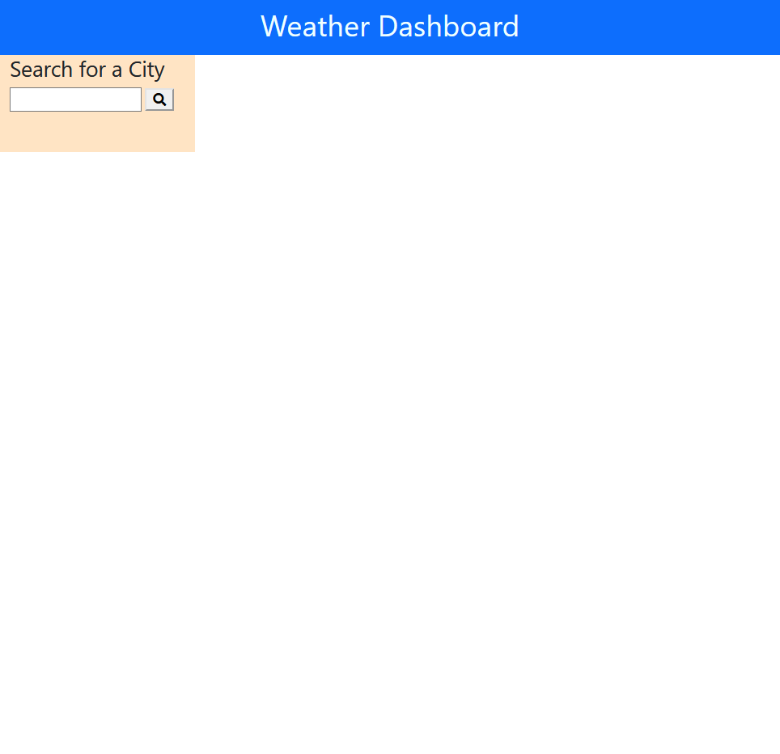
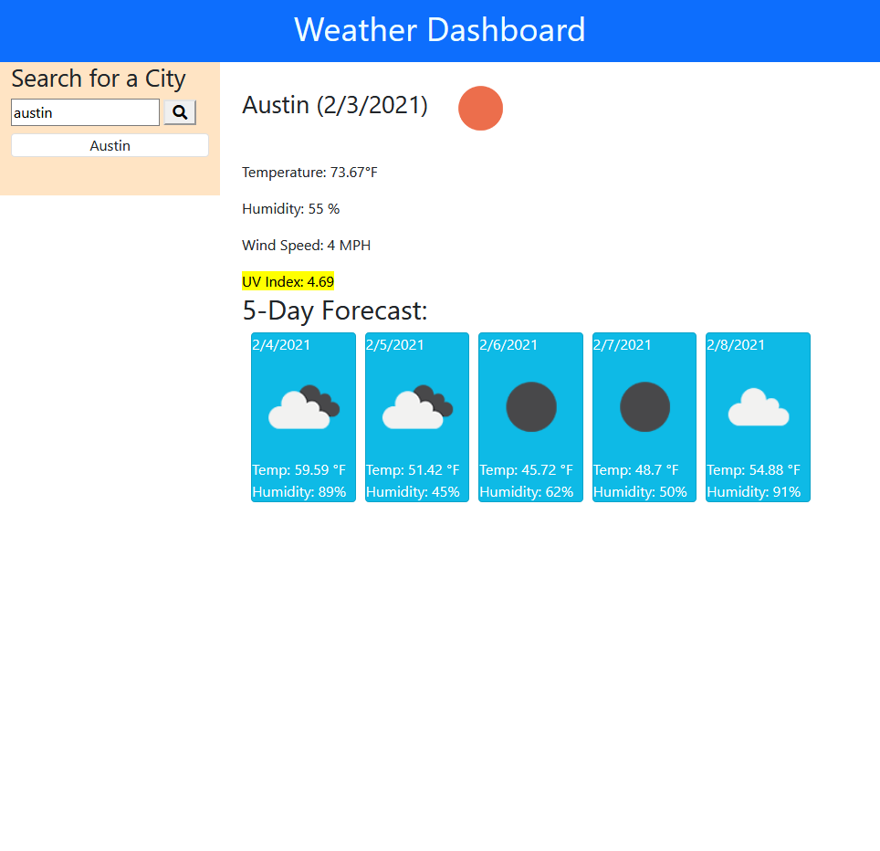
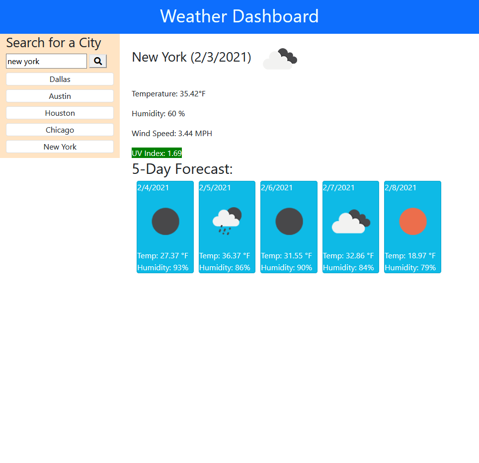
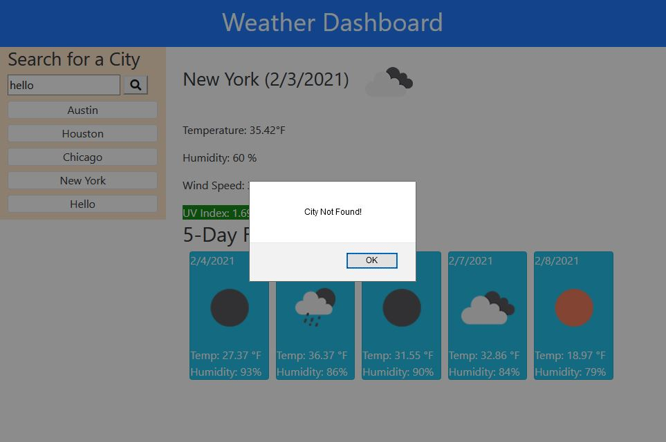

# Weather_Dashboard
## Code Description
A weather dashboard which utilizes an external API (https://openweathermap.org/api) in order to get the weather data of a searched city. The application uses HTML, CSS, JavaScript, and Boostrap. Most of the styles are done with Bootstrap, with a few tweaks being needed through the CSS stylesheet. The HTML contains all of the elements needed to be manipulated to show the different data being called from the API. 

JavaScript is used for fetching the weather data from the API through the use of 3 different fetches to obtain all of the data displayed on the page. First the data is checked to make sure a valid http request has been made, then the needed information is taken from the validated request and input by DOM traversal. The local storage is also used to keep previous searches listed on the page after the page has been refreshed.

## Function
The Weather Dashboard can be used to receive information about a city by typing in the city's name in the search bar on the page. When the search button is clicked on, the city is displayed with today's date alongside a weather icon, as well as a 5-day forecast. The current weather displays the temperature (°F), humidity (%), wind speed (mph), and UV index, with the UV index highlighted in the color of the range that it is in. The 5-day forecast lists the next 5 days with the dates, weather icon, temperature and humidity for each day.

## Live Link
https://riraq.github.io/Weather_Dashboard/
## Screenshots
### Main Page

### One Searched City

### Five Searched Cities

### Error
